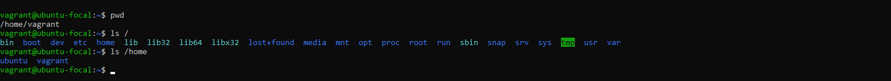

# linux-fundamentals-vagrant

This project helps to practice basic tasks in linux system administration using vagrant.

## Task 1

**Set up a vagrant server:** To set up a vagrant server, I did the following;

* Created a directory by running `mkdir kodecamp-vagrant-vm`
* Then I changed into the directory

_**Fig. 1:** A screenshot of the terminal after creating the directory_

* Initialised vagrant by running `vagrant init ubuntu/focal64`. This created a file with ubuntu has server.

_**Fig. 2:** A screenshot of the terminal after vagrant was initiated. The command and response were annotated_

* Started the vm by running `vagrant up`. This command downloaded ubuntu box, created, configured and booted up the virtual machine.

_**Fig. 3:** A screenshot of the terminal after the bootup_

* SSHed into the server by running `vagrant ssh`.

_**Fig. 4:** A screenshot of the terminal showing that in was successful sshed into_

## Task 2

**Explore the linux file system**: To explore the linux file system in the already spinned up server, I did the following;

* Inside the vm, I ran `pwd`: This printed my current working directory.
* Next, I ran `ls /`: This listed the top level directories in my server.
* Lastly, I ran `ls /home`: This checked for the user home directories.

_**FIg. 5:** A screenshot of the terminal while I explored the file system_

* Then I created a custom folder structure by running `mkdir -p /home/vagrant/projects/devops`. This command created a directory `/home/vagrant/projects/devops`.
* I used the `ls -R /home/vagrant/projects` to confirm the structure has been created.

_**Fig. 6:** Screenshot of the terminal showing the created structure_

## Task 3

**Manage file permissions and ownership**: To do this, I did the following;
* I created a file named kodecamp-test1.txt running the command `touch kodecamp-test1.txt`. This created an empty file with the name.
* I viewd the current ownership by running `ls -la kodecamp-test1.txt`. This returned the file permissions and ownership.
* The first three permissions `rw-` means the user has read and write permissions.
* The second three permissions `rw-` also means the group has read and write permissions
* While the third set of permissions `r--` means others have only read permission.
* The first vagrant means owner. The second vagrant means Group.

_**Fig. 7:** The terminal with the file created_
* I use the `chmod u+x kodecamp-test1.txt` to add execution permission to the owner.

_**Fig. 8:** The terminal showing that execution permission has been added to the user_
* To change ownership of the created kodecamp-test1.txt file, a new user must be created. I did that by running `sudo adduser ope`. 'Ope" being the name of the intended user.
* Then I made 'Ope' the owner by running `sudo chown ope kodecamp-test1.txt`.

_**Fig. 9:** The terminal showing Ope has the new owner_

## Task 4

**Install and configure a package:** To do this, run the following commands;
* `sudo apt update` updated the package list. This should be done before installing any package.
* `sudo apt install unzip -y` installed 'unzip'. A program that can be used to extract files in linux. The -y flag auto confirms the installation.
* Ran `unzip` after the installation, this confirms it was installed successfully.

_**Fig. 10:** The screenshot shows the installation and confirmation of the process_

## Task 5

**Test remote connectivity**: To test network connectivity, I did the following;
* I pinged the google's public dns server by running `ping 8.8.8.8`
* I also pinged the kodecamp offical website by running `ping -c 5 kode.camp`. Both commands were successful

_**Fig. 11:** The screenshot of the terminal after testing for connectivity_

* The first ping shows connection to google's pubic dns was successful. The second shows connection to kodecamp's website was successful. The '-c 5' sends five packets and ended the connection.
